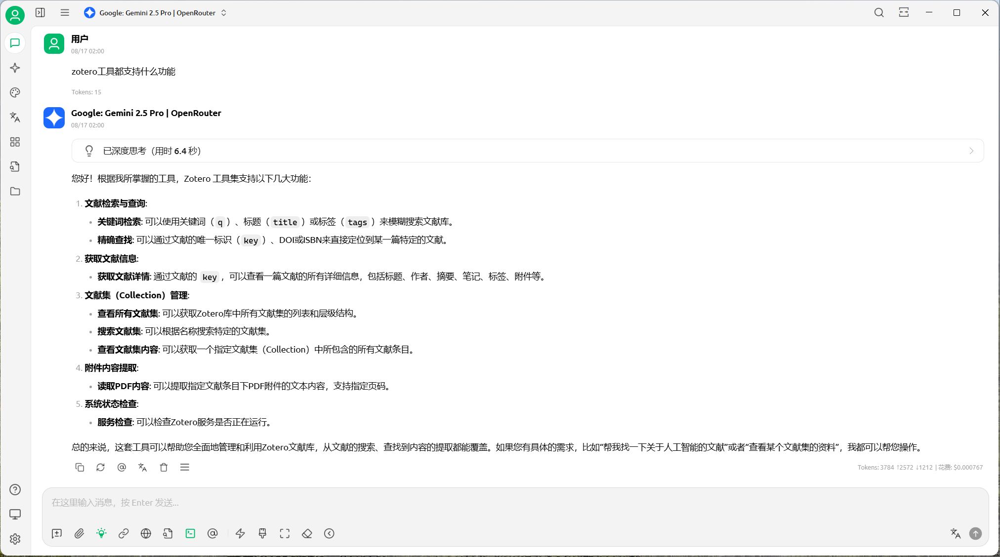
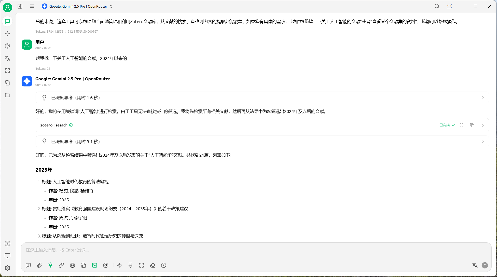
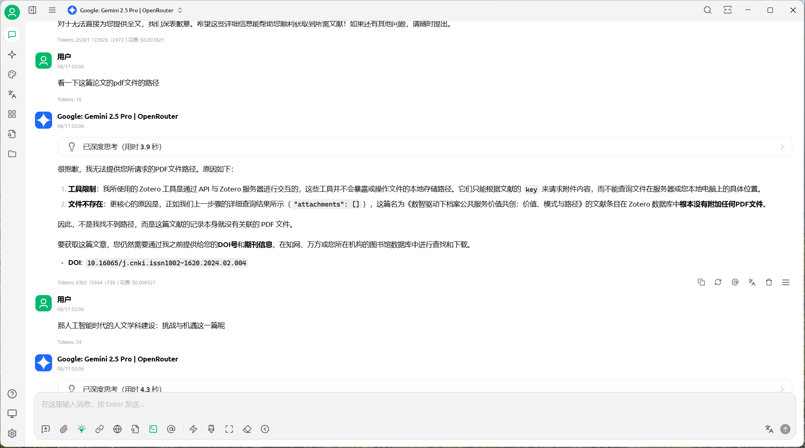
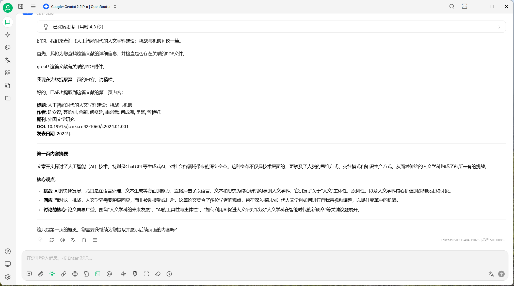
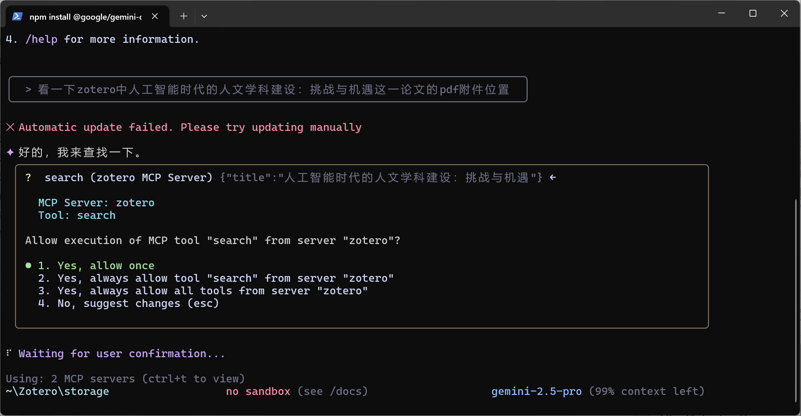
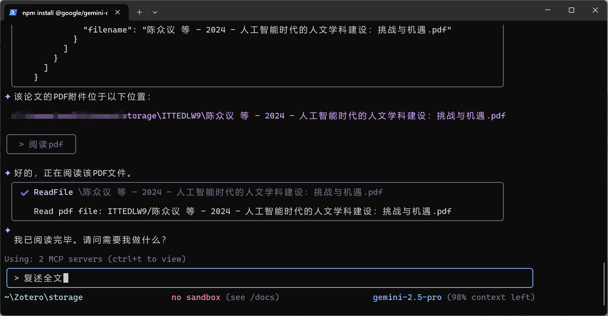

# Zotero MCP - Model Context Protocol Integration for Zotero

Zotero MCP 是一个开源项目，旨在通过模型上下文协议（Model Context Protocol, MCP）将强大的 AI 功能与领先的文献管理工具 Zotero 无缝集成。该项目包含两个核心组件：一个 Zotero 插件和一个 MCP 服务器，共同为 AI 助手（如 Claude）提供与您本地 Zotero 文献库交互的能力。
_This README is also available in: [:gb: English](./README.md) | :cn: 简体中文._
[](https://github.com/cookjohn/zotero-mcp)
[](https://www.zotero.org)
[](https://nodejs.org)
[](https://www.typescriptlang.org)
[]()
[](README.md)
[](README-zh.md)

---

## 📚 项目概述

Zotero MCP 服务器是一个基于 Model Context Protocol 的工具服务器，它为 Claude Desktop 等 AI 应用提供了与 Zotero 文献管理系统的无缝集成。通过此服务器，AI 助手可以：

- 🔍 智能搜索您的 Zotero 文献库
- 📖 获取文献的详细信息
- 🏷️ 按标签、作者、年份等多维度筛选文献
- 🔗 通过 DOI、ISBN 等标识符精确定位文献

这使得 AI 助手能够帮助您进行文献综述、引用管理、研究辅助等学术工作。

## 🚀 项目结构

本项目是一个 monorepo，包含以下两个子项目：

1.  **`zotero-mcp-plugin`**: 一个 Zotero 插件，负责在 Zotero 客户端内部启动一个 HTTP 服务器，暴露用于与文献库交互的 API。
2.  **`zotero-mcp-server`**: 一个独立的 MCP 服务器，它作为 AI 助手与 `zotero-mcp-plugin` 之间的桥梁，将 MCP 工具调用转换为对 Zotero 插件 API 的请求。

---

## 🚀 快速上手指南

本指南旨在帮助普通用户快速配置和使用 Zotero MCP，让您的 AI 助手能够与 Zotero 文献库无缝协作。

### 1. 快速使用教程（面向普通用户）

**Zotero MCP 是什么？**

简单来说，Zotero MCP 是一座桥梁，它连接了您的 AI 客户端（如 Cherry Studio, Gemini CLI, Claude Desktop 等）和本地的 Zotero 文献管理软件。通过它，AI 助手可以直接搜索、查询和引用您 Zotero 库中的文献，极大地提升学术研究和写作效率。

**三步快速开始：**

1.  **安装插件**：
    *   前往项目的 [Releases 页面](https://github.com/cookjohn/zotero-mcp/releases) 下载最新的 `zotero-mcp-plugin.xpi` 文件。
    *   在 Zotero 中，通过 `工具 -> 附加组件` 安装该 `.xpi` 文件。
    *   重启 Zotero。

2.  **安装 MCP Server**：
    打开您的终端（Terminal、命令提示符或 PowerShell）。
    *   运行以下命令进行全局安装：
        ```bash
        npm install -g zotero-mcp
        ```
    *   安装后，您需要找到 `zotero-mcp` 包的主脚本文件 `index.js` 的完整路径。
    *   首先，运行以下命令找到 npm 全局模块的安装目录：
        ```bash
        npm root -g
        ```
    *   该命令会输出一个路径，例如 `C:\Users\YourUser\AppData\Roaming\npm\node_modules` (Windows) 或 `/home/user/.nvm/versions/node/v20.11.1/lib/node_modules` (macOS/Linux)。
    *   将此路径与 `/zotero-mcp/build/index.js` 拼接起来，就构成了您需要的完整脚本路径。
    *   **最终路径示例**: `C:\Users\YourUser\AppData\Roaming\npm\node_modules\zotero-mcp\build\index.js`

3.  **连接 AI 客户端**：
    *   根据您使用的 AI 客户端，参考下面的指南配置 MCP 服务器。通常直接粘贴配置以下配置文件即可开始使用。
    ```json
    {
      "mcpServers": {
          "zotero": {
            "command": "node",
            "args": ["/path/to/your/zotero-mcp/build/index.js"]
          }
      }
    }
    ```
    **重要提示**:
    *   请将 `/path/to/your/zotero-mcp/build/index.js` 替换为您在 **第 2 步** 中获取的 **完整脚本路径**。
    *   例如: `C:\\Users\\YourUser\\AppData\\Roaming\\npm\\node_modules\\zotero-mcp\\build\\index.js` (在 JSON 中请注意 Windows 路径需要使用双反斜杠 `\\` 进行转义)。

配置完成后，您就可以在 AI 助手中通过自然语言与您的 Zotero 文献库进行交互了。

**示例:**

-   `"帮我查找一下我的 Zotero 库里所有关于“人工智能”的文献"`
-   `"获取去年由 Hinton 发表的关于 transformer 的期刊文章"`
-   `"查找 DOI 为 10.1038/nature14539 的文献"`

---

### 2.  MCP Server详细说明

现在，您可以通过 npm 全局安装 Zotero MCP Server，这是最简单、最推荐的方式。

1.  **安装 Server**：
    *   打开您的终端（Terminal、命令提示符或 PowerShell）。
    *   运行以下命令进行全局安装：
        ```bash
        npm install -g zotero-mcp
        ```
    *   NPM 包页面: [https://www.npmjs.com/package/zotero-mcp](https://www.npmjs.com/package/zotero-mcp)

2.  **获取 Server 脚本路径**：
    *   安装后，您需要找到 `zotero-mcp` 包的主脚本文件 `index.js` 的完整路径。
    *   首先，运行以下命令找到 npm 全局模块的安装目录：
        ```bash
        npm root -g
        ```
    *   该命令会输出一个路径，例如 `C:\Users\YourUser\AppData\Roaming\npm\node_modules` (Windows) 或 `/home/user/.nvm/versions/node/v20.11.1/lib/node_modules` (macOS/Linux)。
    *   将此路径与 `/zotero-mcp/build/index.js` 拼接起来，就构成了您需要的完整脚本路径。
    *   **最终路径示例**: `C:\Users\YourUser\AppData\Roaming\npm\node_modules\zotero-mcp\build\index.js`

---

### 3. 连接 AI 客户端

**重要提示**：Zotero MCP Server 是由您的 AI 客户端在需要时 **自动启动** 的，您 **无需** 手动运行任何命令。

您需要在 AI 客户端中配置 `node` 来执行上一步获取的 **完整脚本路径**。

#### a) Cherry Studio 配置

1.  **打开设置**：进入 `Settings -> Advanced -> MCP Servers`。
2.  **点击 "Import from JSON"** 并粘贴以下内容：
    ```json
    {
      "mcpServers": {
          "zotero": {
            "command": "node",
            "args": ["/path/to/your/zotero-mcp/build/index.js"]
          }
      }
    }
    ```
    **重要提示**:
    *   请将 `/path/to/your/zotero-mcp/build/index.js` 替换为您在 **第 2 步** 中获取的 **完整脚本路径**。
    *   例如: `C:\\Users\\YourUser\\AppData\\Roaming\\npm\\node_modules\\zotero-mcp\\build\\index.js` (在 JSON 中请注意 Windows 路径需要使用双反斜杠 `\\` 进行转义)。

3.  **保存配置**：点击 "Save" 按钮。

#### b) Gemini CLI 配置

1.  **编辑配置文件** (`gemini_config.json`)：
    ```json
    "mcp_servers": {
      "zotero": {
        "command": ["node", "/path/to/your/zotero-mcp/build/index.js"]
      }
    }
    ```
    *将 `/path/to/your/.../index.js` 替换为您获取的实际路径。*

#### c) Claude Desktop 配置

1.  **找到配置文件**：
    *   Windows: `%APPDATA%\Claude\claude_desktop_config.json`
    *   macOS: `~/Library/Application Support/Claude/claude_desktop_config.json`
2.  **添加配置**：
    ```json
    {
      "mcpServers": {
        "zotero": {
          "command": "node",
          "args": ["/path/to/your/zotero-mcp/build/index.js"],
          "env": {}
        }
      }
    }
    ```
    *将 `/path/to/your/.../index.js` 替换为您获取的实际路径。*

#### d) Cursor IDE 配置

1.  **打开配置文件** (`mcp.json`)：
    ```json
    {
      "servers": {
        "zotero": {
          "command": "node",
          "args": ["/path/to/your/zotero-mcp/build/index.js"]
        }
      }
    }
    ```
    *将 `/path/to/your/.../index.js` 替换为您获取的实际路径。*

#### e) ChatBox 配置

1.  **进入设置**：`设置 -> 工具 -> MCP`。
2.  **添加服务器**：
    *   **服务器名称**: `zotero`
    *   **命令**: `node`
    *   **参数**: 填入您上一步获取的 `index.js` **完整路径**。

---

### 3. 验证与故障排查

配置完成后，如何确认一切正常工作？

**1. 验证连接**

*   **查看客户端状态**：大多数 AI 客户端（如 ChatBox, Cherry Studio）的 MCP 配置界面会显示服务器的连接状态。如果显示为 "Connected" 或绿色指示灯，说明连接已成功建立。
*   **使用测试命令**：在 AI 助手的聊天框中，发送一个简单的测试命令，例如：
    `"使用 zotero 工具查找任何文献，返回一条即可"`
    如果 AI 能够调用 `zotero.search_library` 并返回结果，说明整个链路已通。

**2. 故障排查指南**

如果连接失败或工具不工作，请按以下步骤排查：

| 步骤 | 检查项 | 解决方案 |
| :--- | :--- | :--- |
| **1** | **Zotero 插件服务** | 确保 Zotero 正在运行，并且在 `首选项 -> Zotero MCP Plugin` 中，"Enable Server" 已被勾选。 |
| **2** | **路径配置** | 确认 AI 客户端中的 `command` 设置为 `node`，并且作为参数的 `index.js` **绝对路径**完全正确。路径错误是导致失败的最常见原因。 |
| **3** | **端口冲突** | 如果 Zotero 插件端口 `23119` 被占用，请在插件设置中更换端口，并在 `zotero-mcp-server` 目录下创建 `.env` 文件，内容为 `ZOTERO_API_PORT=新端口号`。 |
| **4** | **查看日志** | 大多数客户端都提供 MCP 服务器的日志输出功能。在 MCP 配置界面寻找 "Show Logs" 或类似的按钮。日志是定位问题的最有效工具，通常会明确指出是路径错误、命令失败还是其他问题。 |
| **5** | **防火墙/安全软件** | 确认您的防火墙或安全软件没有阻止 `node.exe` (Windows) 或 `node` (macOS/Linux) 的网络通信。 |
| **6** | **环境依赖** | 确保您的系统中已安装 Node.js (版本 18+)。您可以在终端中运行 `node -v` 来检查版本。 |

**3. 常见错误信息**

*   **`command not found` 或 `spawn ENOENT`**: 通常表示 `node` 命令不存在或路径错误。请检查 Node.js 是否已正确安装并加入了系统环境变量，或者检查客户端配置中的命令是否正确。
*   **`Error: connect ECONNREFUSED 127.0.0.1:23119`**: 表示 MCP 服务器无法连接到 Zotero 插件。请执行上述排查指南的第 1 步和第 3 步。
*   **JSON 格式错误**: 在手动编辑配置文件时，请确保您的 JSON 语法正确，没有遗漏逗号或括号。

如果以上步骤均无法解决问题，请前往 [GitHub Issues](https://github.com/cookjohn/zotero-mcp/issues) 页面，并附上您的操作系统、客户端版本和相关的日志信息，以便我们更好地帮助您。

---

## 🧩 zotero-mcp-plugin (Zotero 插件)

`zotero-mcp-plugin` 是一个安装在 Zotero 客户端的插件，它在 Zotero 内部启动一个轻量级 HTTP 服务器，用于接收来自 `zotero-mcp-server` 的请求。

### 主要功能

-   **内置 HTTP 服务器**: 在 Zotero 内部启动一个轻量级 HTTP 服务器。
-   **数据访问 API**: 提供一系列 API 端点，用于安全地访问和操作 Zotero 数据。
-   **文献集管理**: 允许浏览、搜索和检索指定文献集中的条目。
-   **高级标签搜索**: 支持强大的标签查询功能，包括 `any` (任意)、`all` (全部)、`none` (无) 模式，以及 `exact` (精确)、`contains` (包含)、`startsWith` (开头为) 匹配。
-   **PDF 文本提取**: 能够从 PDF 附件中提取全文或指定页码的文本内容。
-   **可配置性**: 用户可以在 Zotero 首选项中轻松配置服务器端口、启用或禁用服务。

---

## 🖥️ zotero-mcp-server (MCP 服务器)

`zotero-mcp-server` 是一个符合 Model Context Protocol 规范的工具服务器，充当 AI 助手与 Zotero 插件之间的桥梁。

### 主要功能

-   **MCP 工具集**: 提供一组标准化的 MCP 工具（如 `search_library`, `get_item_details`），供 AI 助手调用。
-   **智能搜索**: 支持对文献库进行全文搜索，并可按标题、作者、年份、标签、文献类型等多维度进行精确筛选和排序。
-   **标识符查找**: 可通过 DOI、ISBN 等唯一标识符快速、精确定位文献。
-   **协议转换**: 将 AI 助手的 MCP 请求转换为对 `zotero-mcp-plugin` HTTP API 的调用。
-   **本地化运行**: 作为本地进程运行，确保数据安全，所有操作均在本地完成。

---

## 效果展示

这里是一些展示 Zotero MCP 功能的截图：

| 功能 | 截图 |
| :--- | :---: |
| **功能说明** |  |
| **文献检索** |  |
| **元数据查看** |  |
| **全文读取 1** |  |
| **全文读取 2** |  |
| **附件检索 (Gemini CLI)** |  |
| **PDF 读取 (Gemini CLI)** |  |

---

## 👨‍💻 开发者安装指南

### 前置要求

- **Zotero** 7.0 或更高版本
- **Node.js** 18.0 或更高版本
- **npm** 或 **yarn** 包管理器
- **Git**

### 步骤 1: 安装和配置 Zotero 插件

1.  前往项目的 [Releases 页面](https://github.com/cookjohn/zotero-mcp/releases) 下载最新的 `zotero-mcp-plugin.xpi` 文件。
2.  在 Zotero 中，通过 `工具 -> 附加组件` 安装该 `.xpi` 文件。
3.  在 Zotero 的 `首选项 -> Zotero MCP Plugin` 标签页中，勾选 "Enable Server" 来启动插件内置的 HTTP 服务器。

### 步骤 2: 安装和配置 MCP 服务器

作为开发者，您可以选择从源代码构建和运行，或者使用已发布的 npm 包。

**方式一：从源代码运行 (推荐用于开发)**

1.  克隆本仓库到本地：
    ```bash
    git clone https://github.com/cookjohn/zotero-mcp.git
    cd zotero-mcp
    ```
2.  进入 `zotero-mcp-server` 目录，安装依赖并构建项目。该目录包含了 MCP Server 的所有源代码。
    ```bash
    cd zotero-mcp-server
    npm install
    npm run build
    ```
3.  运行开发服务器：
    ```bash
    npm start
    ```
    或者直接通过 node 运行构建后的文件：
    ```bash
    node build/index.js
    ```

**方式二：使用发布的 npm 包**

如果您想测试或使用已发布的版本，可以直接全局安装：
```bash
npm install -g zotero-mcp
```
然后通过 `zotero-mcp` 命令启动。

### 步骤 3: 集成到 AI 助手 (以 Claude Desktop 为例)

1.  找到 Claude Desktop 配置文件：
    -   **Windows**: `%APPDATA%\Claude\claude_desktop_config.json`
    -   **macOS**: `~/Library/Application Support/Claude/claude_desktop_config.json`
    -   **Linux**: `~/.config/Claude/claude_desktop_config.json`

2.  编辑配置文件，添加 Zotero MCP 服务器的路径：
    ```json
    {
      "mcpServers": {
        "zotero": {
          "command": "node",
          "args": ["/path/to/your/zotero-mcp/zotero-mcp-server/build/index.js"],
          "env": {}
        }
      }
    }
    ```
    **注意**: 将 `/path/to/your/zotero-mcp/` 替换为您的实际项目路径。

3.  重启 Claude Desktop 应用。

### 步骤 4: 开始使用

配置完成后，您就可以在 AI 助手中通过自然语言与您的 Zotero 文献库进行交互了。

**示例:**

-   `"帮我查找一下我的 Zotero 库里所有关于“人工智能”的文献"`
-   `"获取去年由 Hinton 发表的关于 transformer 的期刊文章"`
-   `"查找 DOI 为 10.1038/nature14539 的文献"`

---

## 👨‍💻 开发者文档

### 技术架构

```
┌─────────────┐     MCP      ┌─────────────┐     HTTP      ┌─────────────┐
│   Claude    │<------------>│  MCP Server │<------------>│ Zotero Plugin │
│   Desktop   │    stdio     │  (本项目)    │   localhost  │ (内置HTTP服务) │
└─────────────┘              └─────────────┘              └─────────────┘
```

1.  **Claude Desktop** 通过 stdio 协议与 MCP 服务器通信。
2.  **MCP 服务器** 将工具调用转换为对 Zotero 插件的 HTTP 请求。
3.  **Zotero 插件** 调用内部 Zotero API 处理请求并返回数据。
4.  数据流向相反方向返回给用户。

### 插件开发 (`zotero-mcp-plugin`)

1.  进入插件目录并安装依赖：
    ```bash
    cd zotero-mcp-plugin
    npm install
    ```
2.  启动开发模式：
    ```bash
    npm start
    ```
    这将启动 Zotero 并自动加载插件。代码更改时会自动重载。

3.  构建插件 `.xpi` 文件：
    ```bash
    npm run build
    ```

### 服务器开发 (`zotero-mcp-server`)

1.  进入服务器目录并安装依赖：
    ```bash
    cd zotero-mcp-server
    npm install
    ```
2.  构建服务器：
    ```bash
    npm run build
    ```
3.  启动服务器进行测试：
    ```bash
    npm start
    ```

---

## 🔧 API 参考

`zotero-mcp-server` 提供了以下工具供 AI 助手调用：

### `search_library`

搜索 Zotero 文献库。

| 参数 | 类型 | 必需 | 描述 |
|---|---|---|---|
| `q` | string | 否 | 通用搜索关键词（标题、作者、年份） |
| `title` | string | 否 | 标题关键词 |
| `creator` | string | 否 | 作者姓名 |
| `year` | string | 否 | 年份或年份范围（如 "2020" 或 "2020-2024"） |
| `tag` | string | 否 | 标签，多个用逗号分隔 |
| `itemType` | string | 否 | 文献类型（如 "journalArticle", "book"） |
| `collectionKey` | string | 否 | 文献集 Key |
| `hasAttachment` | boolean | 否 | 是否有附件 |
| `hasNote` | boolean | 否 | 是否有笔记 |
| `limit` | number | 否 | 返回结果数量（最大 500，默认 100） |
| `offset` | number | 否 | 分页偏移量 |
| `sort` | string | 否 | 排序方式：relevance, title, creator, date, dateAdded, dateModified |
| `direction` | string | 否 | 排序方向：asc, desc |
| `fields` | string | 否 | 自定义返回字段，逗号分隔 |

### `get_item_details`

获取单个文献的完整信息。

| 参数 | 类型 | 必需 | 描述 |
|---|---|---|---|
| `itemKey` | string | 是 | 文献的唯一 Key |

### `find_item_by_identifier`

通过 DOI 或 ISBN 查找文献。

| 参数 | 类型 | 必需 | 描述 |
|---|---|---|---|
| `doi` | string | 否* | 文献的 DOI |
| `isbn` | string | 否* | 书籍的 ISBN |

*至少需要提供 `doi` 或 `isbn` 中的一个。

---

## 🐛 常见问题 (FAQ)

#### 1. 连接被拒绝错误

**问题**: `Error: connect ECONNREFUSED 127.0.0.1:PORT`
**解决方案**:
- 确保 Zotero 正在运行。
- 检查 Zotero 插件是否已启用。
- 确认插件设置中的端口号与服务器的预期端口一致。

#### 2. 服务器启动失败

**问题**: `Failed to start server`
**解决方案**:
- 检查 Node.js 版本是否 >= 18.0。
- 确保已在 `zotero-mcp-server` 目录运行 `npm install` 和 `npm run build`。

#### 3. Claude Desktop 无法识别工具

**问题**: Claude 不显示 Zotero 相关工具。
**解决方案**:
- 检查 `claude_desktop_config.json` 中的路径是否正确。
- 确保 JSON 格式正确。
- 重启 Claude Desktop。

---

## 🤝 贡献指南

欢迎贡献代码、报告问题或提出建议！

1.  Fork 本仓库。
2.  创建您的功能分支 (`git checkout -b feature/AmazingFeature`)。
3.  提交您的更改 (`git commit -m 'Add some AmazingFeature'`)。
4.  推送到分支 (`git push origin feature/AmazingFeature`)。
5.  开启一个 Pull Request。

## 📄 许可证

本项目采用 [MIT License](./LICENSE) 授权。

## 🙏 致谢

- [Zotero](https://www.zotero.org/) - 优秀的开源文献管理工具。
- [Model Context Protocol](https://modelcontextprotocol.org/) - 实现 AI 工具集成的协议。
- [](https://github.com/windingwind/zotero-plugin-template)